
<h1 align="center">基于JAVA的大学生兼职雇佣系统</h1>

## 简介
基于大学生兼职雇佣系统：角色分为学生、企业、管理员；提供职位管理、信息发布、学生管理、互动交流、投诉建议管理等功能。界面设计简洁友好，支持多种用户操作。    --计算机毕业设计源码；毕设源码；java毕业设计源码

## 联系方式

<h3 align="center">获取完整代码与数据库文件 + 微信：deepguan QQ: 86050149 QQ群: 783742310</h3>

<h3 align="center">可帮忙远程部署 包运行成功！提供远程部署、修改代码、设计文档指导、代码讲解等服务！</h3>

## 功能介绍（完整见运行截图）
管理员： 管理员可以访问个人中心、后台管理等页面，进行编辑岗位类型、职位信息管理、学生和企业信息管理等操作，查看、修改、删除招聘信息、投诉建议及岗位类型，并通过富文本编辑器发布和管理网站公告及论坛帖子。

学生： 学生可以通过首页访问职位信息、论坛交流等页面，进行注册或登录后，浏览和收藏兼职岗位，通过在线表单填写兼职申请、咨询信息或发布论坛帖子，在个人中心查看和管理应聘信息、收藏、投诉建议等。

企业： 企业用户可以通过注册或登录访问个人中心，管理招聘信息，上传企业职位及简历，查看学生应聘信息，并参与论坛交流，同时能够编辑企业信息，管理职位申请及岗位类型。

游客： 游客可以在首页浏览基本网站信息，包括职位介绍、网站公告、关于我们页面及论坛交流等，无法进行个人中心的深度操作，需注册或登录才能收藏岗位、参与论坛互动及申请兼职。

## 运行截图

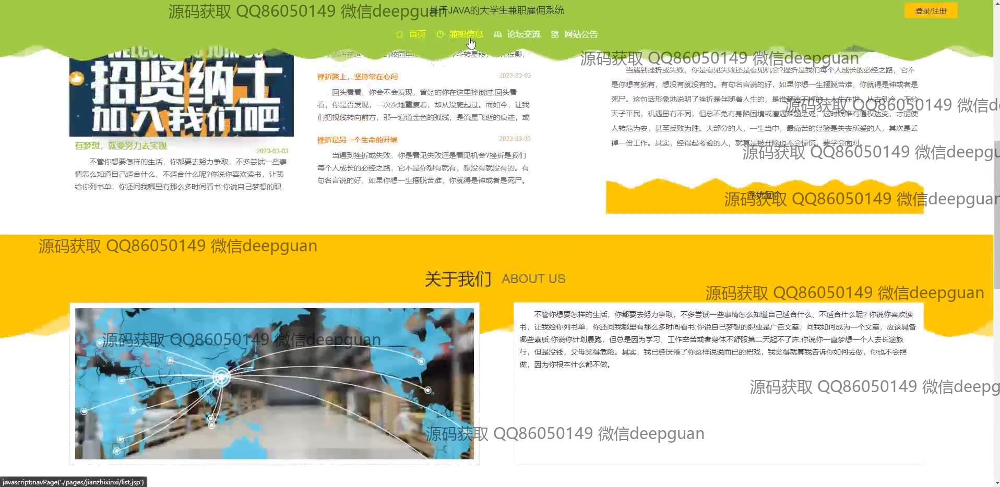

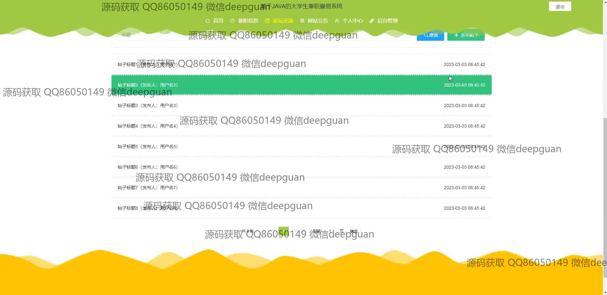

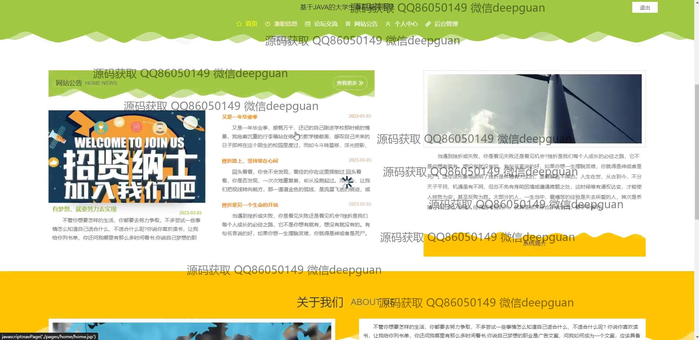
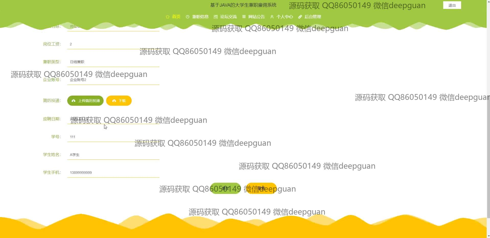
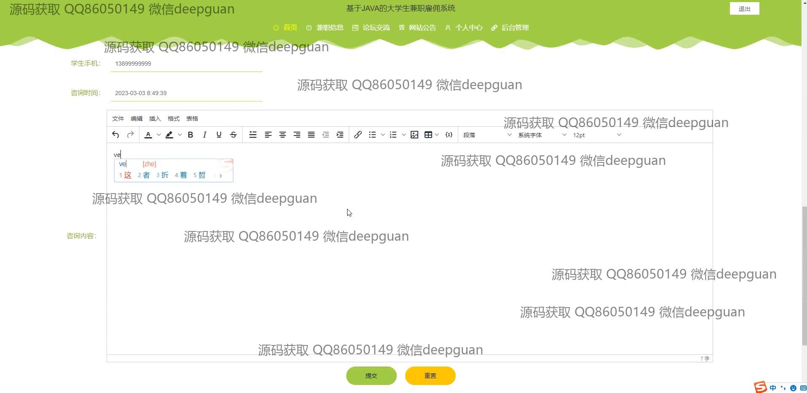
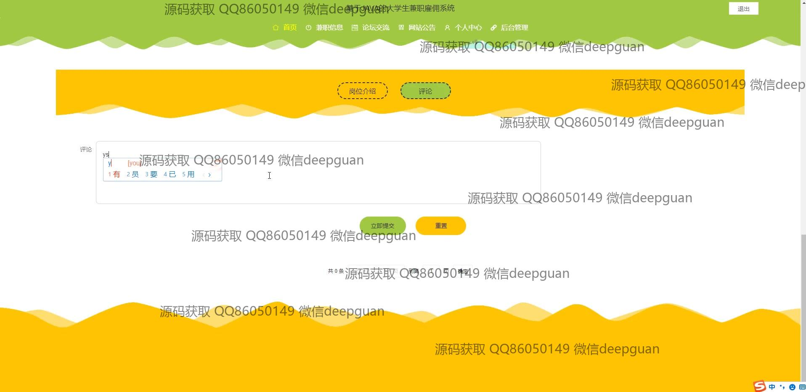

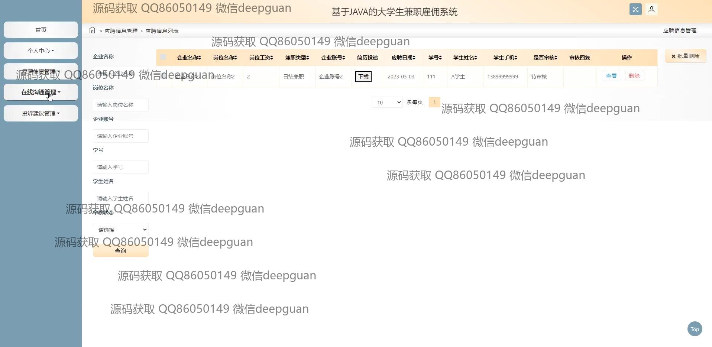
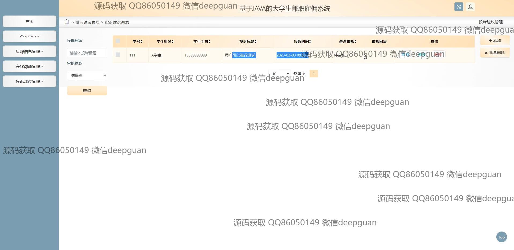
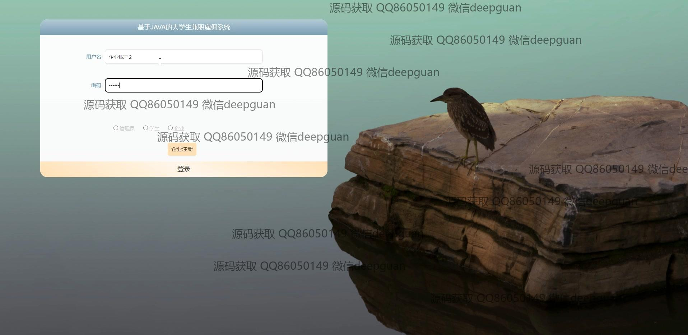
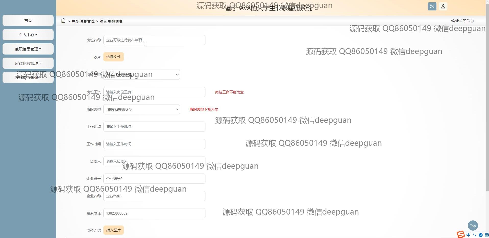
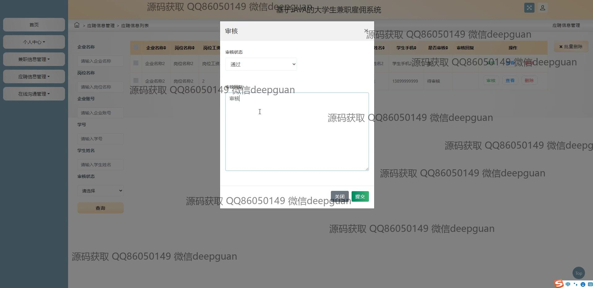
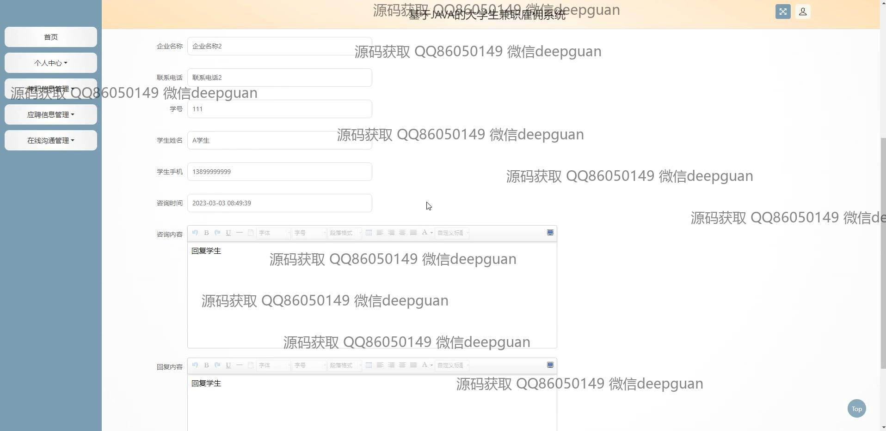
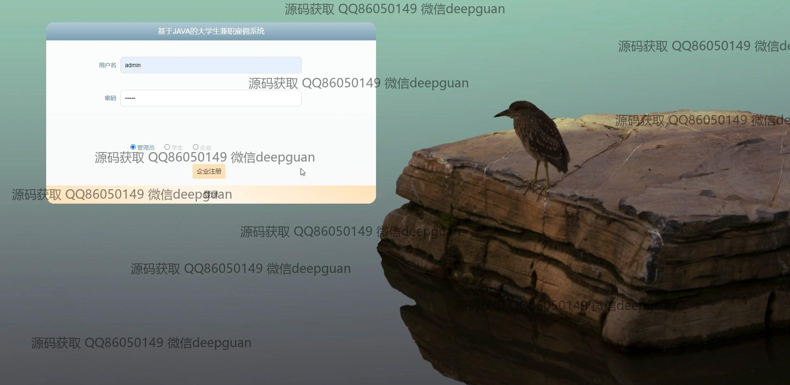
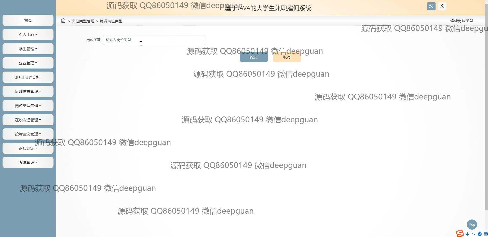
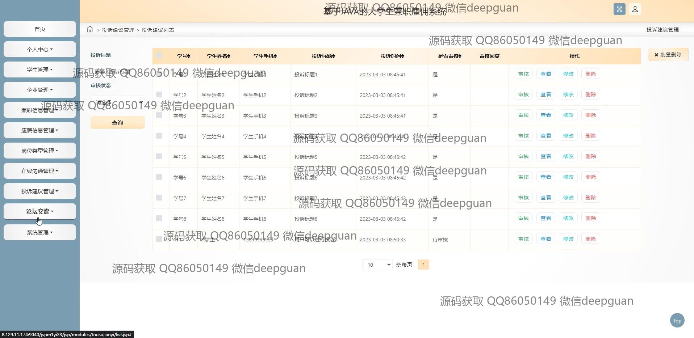
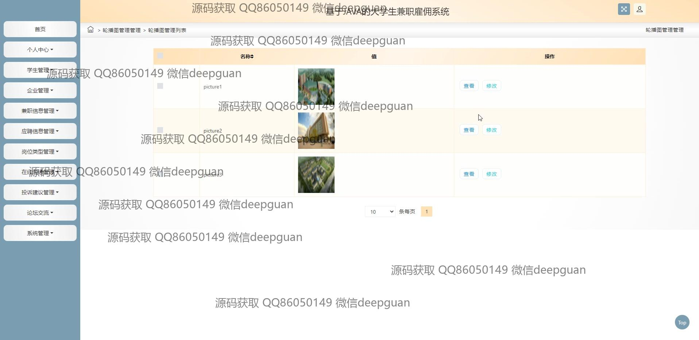

本代码来源于网络,仅供学习参考使用!

